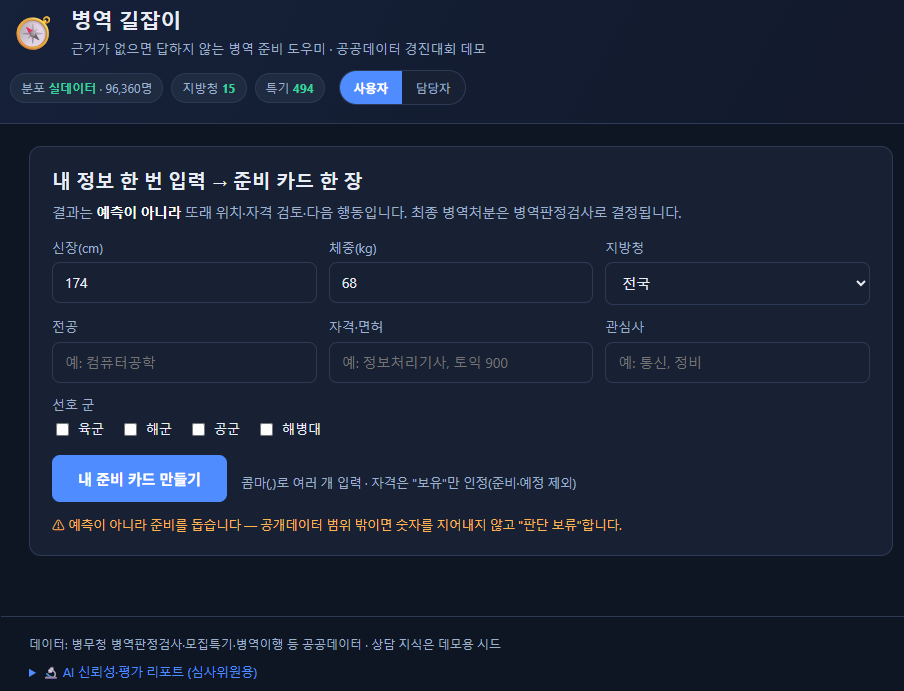
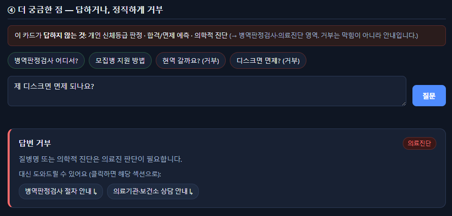

# 병역 길잡이

> 근거가 없으면 답하지 않는 병역 준비 도우미
> 2026 병무청·방위사업청·질병관리청 합동 공공데이터·AI 경진대회 (제품·서비스 개발 부문)

## 1. 서비스 한 줄 정의

병무청 공공데이터를 근거로 **병역판정 준비·모집병 특기 탐색·병역진로 상담·민원 응답**을 돕는
AI 도우미. 병역처분을 **예측하지 않고**, 근거가 부족하면 **답변을 거부**한다.

## 2. 데모 영상

- **라이브 데모**: `[배포 후 기입]` (무료·GPU無 배포법 → [`deploy/`](deploy/README.md))
- **데모 영상**(유튜브 미등록): `[업로드 후 기입]` (90초 샷 리스트 → [`docs/데모_영상_시나리오.md`](docs/데모_영상_시나리오.md))

## 3. 핵심 차별점 — 예측하지 않고 거부하는 AI

- **'많이 답하는 AI'가 아니라 '안전하게 거부하는 AI'** — 위험질문(개인 신체등급 판정·합격/면제
  예측·의학적 진단)을 게이트가 자동 거부하고, 막힘 대신 **우회로**(관련 섹션)를 안내한다.
- **숫자는 계산기가, 설명은 AI가** — BMI 백분위·자격요건처럼 정확성이 중요한 값은 검증된
  결정론 로직이 계산(**틀린 숫자 없음**), 생성형은 설명·상담만 담당한다.
- **근거와 출처를 항상 함께** — 모든 답변에 근거 문장·출처를 붙이고, 근거가 부족하면 거부한다.
- **특기 추천 이중 구조** — 공개 자격요건 결정론 필터 + bge-m3 의미 관련도 정렬 + 실 모집 경쟁률.
- **측정·검증한 AI** — 성능 평가를 제품에 내장하고, 학습에 쓰지 않은 **held-out**으로 일반화
  갭까지 정직하게 공개한다(§7).

## 4. 주요 기능

| 기능 | 내용 | 근거 데이터 |
|---|---|---|
| 준비 카드(또래 백분위) | 신장·체중·BMI 또래 위치·14지방청 히트맵 — 결정론 계산(환각 불가) | 3064321 |
| 특기 매칭 | 자격충족(결정론 검증) + bge-m3 의미랭킹 + 실 모집 경쟁률(참고) | 3066750 · 15031295 |
| 준비 로드맵 | 내 지방청 복무기관·소집계획·공석·진로설계센터 결합 | 3066757 · 3066753 · 3066754 · 15148370 |
| 근거 상담 | 근거·출처 함께 제시, 위험질문 자동 거부 + 우회로 | 상담 KB(데모 시드) |
| 담당자(B2G) | 14지방청 청년건강 히트맵 · 민원 자동분류 집계 | 3064321 |

## 5. 공공데이터 활용 목록 (실사용 7종 / 정직 제외 2종)

실제 호출·사용하는 데이터만 '실사용'으로 표기한다. 수집·집계는 `scripts/fetch_*.py`로 재현.

| 용도 | data.go.kr ID | 실연동 |
|---|---|---|
| 신검 정보(키·체중·BMI, 96,360명 준-전수) | 3064321 | ✅ 백분위·14지방청 히트맵 |
| 모집병 특기 매칭 | 3066750 | ✅ 494특기 인덱스 |
| 모집병 접수현황(경쟁률) | 15031295 | ✅ 특기별 경쟁률(참고·모호 미표시) |
| 사회복무 복무기관 | 3066757 | ✅ 22,028건→지방청 인덱스 |
| 사회복무 소집계획 | 3066753 | ✅ 21,100건→분야 집계 |
| 사회복무 본인선택 공석 | 3066754 | ✅ 216,799건→지방청 집계 |
| 병역진로설계센터 위치 | 15148370 | ✅ 11센터→지방청(fileData CSV) |
| ~~신장 분포(15117367)~~ | 15117367 | ⛔ 제외 — 3064321 준-전수로 상위 대체(중복) |
| ~~감염병(15139178)~~ | 15139178 | ⛔ 제외 — 라이선스 제4유형(상업이용금지) |

**출처·이용조건**: 공공데이터포털(data.go.kr)에서 **공공누리(KOGL)** 조건에 따라 이용하며,
출처는 "**병무청, 공공데이터포털**"로 표시한다(상세 유형은 각 데이터셋 페이지 기준). 상업이용금지
(제4유형)인 감염병(15139178)은 사업화(SaaS) 충돌로 제외했다. 코드 라이선스는 [`LICENSE`](LICENSE) 참조.

## 6. 아키텍처

```
src/mma_navi/        # 코어 패키지
  percentile.py      # 결정론 백분위 엔진 (환각 구조적 불가, gap-aware abstain)
  dataio.py          # 분포 로딩(CSV) + microdata→히스토그램 빌더
  mma_api.py         # data.go.kr 오픈API 클라이언트(키 redaction 포함)
  rag/               # 상담 RAG + 거부 게이트 (안전성 핵심축)
    gates.py         #   의도/근거/일관성 게이트 + 거부 taxonomy
    pipeline.py      #   오케스트레이션(답하거나 거부)
    embed.py         #   bge-m3 임베딩(transformers 직접 로드, CLS+정규화)
    retriever.py     #   BgeRetriever(실 의미검색) + bge-reranker-v2-m3(옵션)
    llm.py           #   LocalLLM(로컬 Qwen, 근거만 생성·예측 금지 프롬프트)
  recommend/         # 모집병 특기 추천
    teukgi.py        #   자격충족(결정론·등급/점수검증) + 관련도 + 비보유 가드
    index.py         #   특기 단위 인덱스 매처(자격→특기, ok/본인확인/미달 분리)
    semantic.py      #   bge-m3 의미 관련도(494특기 임베딩+지문캐시)
  classify.py        # 민원 질문 5범주 분류기
  eval/metrics.py    # P/R/F1 + Wilson CI (안전성 증거물)
  app/               # 통합 데모 (코어 → 웹)
    service.py       #   서비스 레이어 + build_roadmap(결과를 다음 행동으로)
    server.py        #   FastAPI 라우트(/api/roadmap|consult|classify|percentile|teukgi|metrics)
web/                 # 단일 페이지 "나의 병역 준비 카드"(입력1회→백분위+특기+로드맵+상담, vanilla JS)
data/                # 실데이터 분포·특기 인덱스(프리빌드 포함) · fixtures(폴백) · 상담 KB
eval/                # 골드셋(dev/held-out) + 메트릭 리포트(RESULTS.md)
tests/               # 자체 테스트 (100+개, 프레임워크 없이 assert)
scripts/             # 데모/수집(fetch_*)/평가(run_eval)/서버(run_server)
```

## 7. AI 안전성 검증 (측정·검증한 AI)

거부게이트·민원분류기를 **독립 생성·검증 골드셋**으로 측정. 학습에 안 쓴 **held-out**으로
일반화 갭까지 공개한다. 수치는 파일로 커밋 → 심사위원이 안 돌려도 확인. 요약: [`eval/RESULTS.md`](eval/RESULTS.md).

**거부 게이트·분류 (키·GPU 없이 재현: `python scripts/run_eval.py`)**

| | 위험질문 자동거부 | 민원 분류 |
|---|---|---|
| **개발셋(dev)** | 정밀도 1.0 / 재현율 1.0 [95%CI .91~1.0] / F1 1.0 (사유분류 F1 0.98) | 정확도 0.98 / 평균 F1 0.98 |
| **미사용셋(held-out)** | 정밀도 0.889 / 재현율 **0.8** [95%CI .49~.94] / F1 0.842 (fn 2·과잉거부 1) | 정확도 0.8 / 평균 F1 **0.807** |

> held-out 재현율 0.8(dev 1.0)로 일반화 갭을 정직 노출, 소표본이라 **Wilson 95%CI 병기**.
> held-out은 튜닝에 쓰지 않아 측정 무결성 유지.

**상담 파이프라인 end-to-end (헤드라인, bge-llm·GPU)** — 원본 [`eval/rag_e2e_report.json`](eval/rag_e2e_report.json)

| 지표 | 값 |
|---|---|
| 종합 정확도 (22문항) | **0.909** |
| 위험질문 거부율 (n=8) | **1.0** |
| 절차질문 답변율 / 평균 근거율 (n=14) | 0.857 / 0.897 |

## 8. 실행 방법

**바로 실행 — 인증키·GPU·모델 다운로드 불필요**
```bash
pip install -r requirements.txt
python scripts/run_server.py            # http://127.0.0.1:8000 — 입력 1회 → 준비 카드 한 장
```
데이터 인덱스가 저장소에 포함되어 **키 없이 즉시** 백분위·특기·로드맵·상담(데모)이 동작한다.

**특기 의미(bge-m3) 랭킹까지 (GPU 불필요, CPU)**
```bash
pip install -r requirements-ml.txt
MMA_RAG=bge-extractive MMA_TEUKGI_SEM=1 python scripts/run_server.py
```

**실 RAG(검색+생성) — GPU + 로컬 Qwen**
```bash
MMA_RAG=bge-llm MMA_EMBED_DEVICE=cpu MMA_LLM_DEVICE=cuda:0 python scripts/run_server.py
python scripts/run_eval.py              # 거부게이트·분류 메트릭(키·GPU 없이)
```
`MMA_RAG`: `mock`(기본) | `bge-extractive`(검색만·환각0) | `bge-llm`(검색+생성).
무료·GPU無 배포는 [`deploy/`](deploy/README.md) 참조. 실데이터 재수집은 `MMA_SERVICE_KEY`(gitignore된 `.env`) 필요.

## 9. 스크린샷

**입력 화면 — 근거 없으면 숫자를 지어내지 않고 "판단 보류"**



**핵심 차별점 — 위험질문을 자동 거부하고 우회로 안내**



> 결과 카드(백분위·특기·로드맵)까지 보려면 §8 '바로 실행'으로 직접 확인.

---

